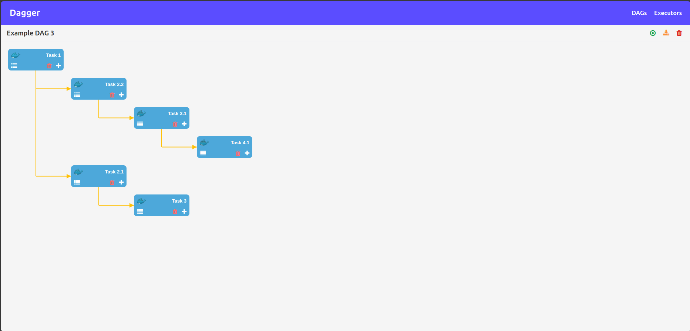

# Dagger

Dagger is a powerful workflow orchestration tool, similar to Apache Airflow, designed for creating and executing Directed Acyclic Graph (DAG) workflows across different execution environments such as Docker.



## Features

-   Define and manage DAG workflows seamlessly.
-   Execute workflows on multiple backends, including Docker.
-   Export DAGs for easy sharing and reuse.
-   Monitor task execution with detailed logging.
-   Define DAGs using YAML configuration files.
-   Supports PostgreSQL as a backend database for reliable storage and management.

## Installation

### Download Binary

1. Download binary from this [Dagger Binary](https://github.com/chiragsoni81245/dagger)

### Build from source code

1. Install [Golang](https://go.dev/dl/).
2. Clone the repository:
    ```sh
    git clone https://github.com/chiragsoni81245/dagger.git
    cd dagger
    ```
3. Build the binary:
    ```sh
    make build
    ```
4. The compiled binary will be located at:
    ```sh
    bin/dagger
    ```

## Usage

### Bootstrap Database

```sh
dagger migrate up --config config.yaml
```

### Starting the Server

To launch the Dagger server, run the following command:

```sh
dagger start --config config.yaml
```

### Configuration File

The `config.yaml` file should be structured as follows:

```yaml
database:
    host: "<database host name>"
    port: <database port>
    user: "<database user>"
    password: "<database password>"
    name: "<database name>"

server:
    port: <port on which server is running>
    log_level: <logging level>
```

### How to reset database

Run this command tear down database content

```sh
dagger migrate down --config config.yaml
```

Now bootstrap database with this command

```sh
dagger migrate up --config config.yaml
```

## Dependencies

-   A running PostgreSQL database instance.
-   Docker installed locally.

## Contribution

We welcome contributions! Feel free to reach out or submit a pull request via GitHub: [@chiragsoni81245](https://github.com/chiragsoni81245).
